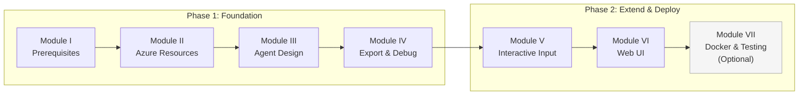
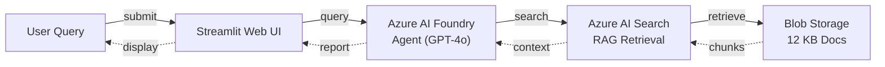

# Compliance Compass — Build AI Agents with Microsoft Foundry, Foundry Toolkit for VS Code & GitHub Copilot

> **Audience:** Developers, Compliance Engineers, Tech Leads, Architects
> **Duration:** ~90 minutes (7 modules)

---

## Prerequisites

### Participant Requirements

Each participant needs the following accounts and tools on their machine:

| Requirement | Details |
|---|---|
| **Azure Subscription** | Active subscription with permission to create resources |
| **GitHub Copilot** | Individual, Business, or Enterprise plan |
| **Visual Studio Code** | Latest version — [Download](https://code.visualstudio.com/download) |
| **Python** | 3.10 or higher — [Download](https://www.python.org/downloads/) |
| **Azure CLI** | 2.60+ and authenticated (`az login`) — [Install](https://learn.microsoft.com/en-us/cli/azure/install-azure-cli) |
| **Git** | Any recent version — [Install](https://git-scm.com/downloads) |
| **Docker Desktop** | *(Optional — Module VII only)* — [Install](https://www.docker.com/products/docker-desktop/) |

**VS Code Extensions required:** GitHub Copilot, GitHub Copilot Chat, Foundry Toolkit for VS Code (Microsoft), Python (Microsoft).

> Full installation and verification steps are in [Module I: Prerequisites and Environment Setup](lab/instructions/01_Prerequisites.md).

### Workshop Infrastructure (Provisioned Before the Session)

The following Azure resources must be provisioned inside each participant's subscription prior to the workshop. All tiers listed are free or low-cost for workshop use.

| Azure Resource | Purpose | Tier / SKU |
|---|---|---|
| **Azure AI Foundry Hub + Project** | Hosts GPT-4o (reasoning) and the embedding model; manages the agent | Standard — no per-hub charge |
| **GPT-4o Deployment** | Language model for compliance reasoning and report generation | Standard deployment (pay-per-use) |
| **text-embedding-ada-002 Deployment** | Embeds knowledge base documents for semantic search | Standard deployment (pay-per-use) |
| **Azure AI Search** | Indexes the 12 compliance documents; provides RAG retrieval | **Free tier** (up to 50 MB / 3 indexes) |
| **Azure Storage Account + Blob Container** | Stores the 12 Markdown knowledge base documents | **LRS Standard** (minimal cost; < 1 MB of documents) |

> [!TIP]
> Module II walks participants through provisioning each of these resources step-by-step, with both portal and Azure CLI instructions. If resources are pre-provisioned by the workshop facilitator, participants can skip directly to the indexing step in Module II.

---

## What You Will Build

**Compliance Compass** — a Retrieval-Augmented Generation (RAG) agent that helps compliance and risk teams evaluate regulatory risks for vendors, data transfers, and cross-border operations.

The agent is powered by:
- **Microsoft AI Foundry** (GPT-4o + embedding model)
- **Azure AI Search** (knowledge retrieval from 12 compliance documents)
- **Foundry Toolkit for VS Code** (visual agent design)
- **GitHub Copilot** (code generation, debugging, UI creation, containerization)

```
Azure = Brain (Models + Search)
Foundry Toolkit for VS Code = Agent Designer
GitHub Copilot = Builder + Debugger + Extender
```

---

## Workshop Flow



---

## Modules

| # | Module | Description | Duration |
|---|---|---|---|
| **I** | [Prerequisites & Environment Setup](lab/instructions/01_Prerequisites.md) | Install tools, configure Azure CLI, sign in to Copilot & Foundry Toolkit for VS Code | 10 min |
| **II** | [Provisioning Azure Resources](lab/instructions/02_Azure_Resources.md) | Create AI Foundry hub, deploy models, set up Blob Storage & AI Search | 15 min |
| **III** | [Designing the Agent in Foundry Toolkit for VS Code](lab/instructions/03_Agent_Design.md) | Build the compliance agent visually with instructions & Azure AI Search tool | 10 min |
| **IV** | [Exporting Code & Debugging with Copilot](lab/instructions/04_Code_Export_Debug.md) | Export to Python, encounter real Azure SDK error, debug with Copilot | 15 min |
| **V** | [Adding Interactive Input](lab/instructions/05_Interactive_Input.md) | Transform hardcoded queries into interactive CLI with Copilot | 10 min |
| **VI** | [Building a Professional Web UI](lab/instructions/06_Web_UI.md) | Generate a complete Streamlit chat UI with Copilot Agent mode | 15 min |
| **VII** | [Containerization & Testing *(Optional)*](lab/instructions/07_Containerize_Test.md) | Dockerize the app *(optional)*, run quality tests, refine agent instructions | 15 min |

---

## Key GitHub Copilot Features Demonstrated

| Feature | Where Used |
|---|---|
| **Agent Mode** | Modules IV–VII: Debugging, code generation, UI creation, Docker |
| **Ask Mode** | Module IV: Understanding generated code |
| **Structured Prompting** | Module IV: Error diagnosis with constraints |
| **Code Extension** | Module V: Adding interactive input loop |
| **Full App Generation** | Module VI: Complete Streamlit UI from a single prompt |
| **DevOps Generation** | Module VII: Dockerfile and test suite creation |

---

## Architecture



---

## Knowledge Base

12 compliance documents covering:
- **RBI** — Data localization, cross-border transactions, vendor onboarding
- **GDPR** — Article 44 transfers, Schrems II, Standard Contractual Clauses
- **DPDP Act** — India's Digital Personal Data Protection Act 2023
- **SEBI** — Insider trading compliance
- **Export Controls** — US/EU/India technology restrictions
- **Frameworks** — Risk scoring, incident response, DPA templates

See [kb_markdown/](kb_markdown/) for all documents.

---

## Getting Started

1. Clone this repository:
   ```bash
   git clone https://github.com/ADKWDHQWQHDQI/Agent-using-GHCP.git
   cd Agent-using-GHCP
   ```

2. Open in VS Code:
   ```bash
   code .
   ```

3. Start with the [Introduction](lab/instructions/00_Introduction.md) or jump directly to [Module I](lab/instructions/01_Prerequisites.md).

---

## Repository Structure

```
Agent-using-GHCP/
├── README.md                          ← This file
├── lab/
│   └── instructions/
│       ├── 00_Introduction.md
│       ├── 01_Prerequisites.md
│       ├── 02_Azure_Resources.md
│       ├── 03_Agent_Design.md
│       ├── 04_Code_Export_Debug.md
│       ├── 05_Interactive_Input.md
│       ├── 06_Web_UI.md
│       └── 07_Containerize_Test.md
├── kb_markdown/                       ← 12 compliance Knowledge Base documents
├── kb_source_pdfs/                    ← Source reference index
└── idea.txt                           ← Original concept document
```

---

## Contributing

This is a workshop repository. For feedback or improvements, open an issue or pull request.

---

## License

This workshop is for educational purposes. All compliance documents are sourced from public regulatory sources. No proprietary or confidential data is included.
