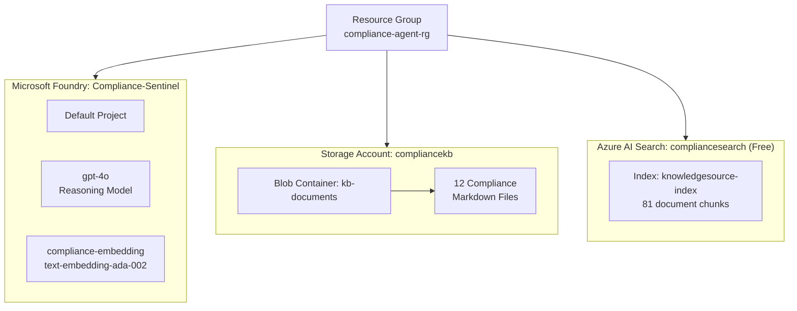

# Module II — Provisioning Azure Resources

> [!NOTE]
> **Duration:** ~15 minutes
> In this module, you will set up all the Azure resources needed to power the Compliance Compass agent: Microsoft Foundry (with models), Blob Storage (for documents), and Azure AI Search (for retrieval).

---

## Objectives

- Create a Resource Group to organize all workshop resources
- Deploy a Microsoft Foundry resource and project with two models (GPT-4o for reasoning, text-embedding for search)
- Create a Storage Account with a Blob container and upload the compliance KB documents
- Set up Azure AI Search (Free tier) and create a knowledge index from the blob data
- Verify the search index with a test query

---

## Architecture of Azure Resources



---

## Step 1: Create a Resource Group

A Resource Group is a logical container for all the Azure resources you will create.

### Option A: Azure Portal

1. Open the [Azure Portal](https://portal.azure.com).

2. In the search bar at the top, type **Resource groups** and select it.

3. Click **+ Create**.

4. Fill in the details:
   - **Subscription:** Select your subscription (e.g., `Visual Studio Enterprise Subscription – MPN`)
   - **Resource group name:** `compliance-agent-rg`
   - **Region:** Select a region that supports Microsoft Foundry (e.g., `East US`, `East US 2`, or `Sweden Central`)

5. Click **Review + create** → **Create**.

### Option B: Azure CLI

```bash
# Set variables for the workshop (reused throughout this module)
# Bash / Git Bash / macOS / Linux:
RESOURCE_GROUP="compliance-agent-rg"
LOCATION="eastus2"

# Windows CMD alternative:
# set RESOURCE_GROUP=compliance-agent-rg
# set LOCATION=eastus2

# Create the resource group
az group create --name $RESOURCE_GROUP --location $LOCATION
```

> [!TIP]
> Use a consistent region for all resources (e.g., `East US 2`). Some AI models are only available in specific regions.
> - **Windows CMD:** Use `set VARIABLE=value` to assign and `%VARIABLE%` to reference (e.g., `set RESOURCE_GROUP=compliance-agent-rg`, then `az group create --name %RESOURCE_GROUP% --location %LOCATION%`).
> - **PowerShell:** Use `$Variable = "value"` directly.
> - **Bash / Git Bash / macOS / Linux:** Use `VARIABLE="value"` and `$VARIABLE` as shown above.

---

## Step 2: Create a Microsoft Foundry Resource and Project

Microsoft Foundry is a unified Azure service for AI operations. Creating a Foundry resource gives you a single resource that hosts models, agents, and projects. A **default project** is automatically created when you deploy your first model.

### 2.1 Create the Foundry Resource

#### Option A: Azure Portal

1. In the Azure Portal, search for **Microsoft Foundry** and select it.

2. Click **+ Create**.

3. Fill in the details:
   - **Subscription:** Your subscription
   - **Resource group:** `compliance-agent-rg`
   - **Region:** Same region as your Resource Group (e.g., `East US 2`)
   - **Name:** `Compliance-Sentinel`

4. Click **Review + create** → **Create**.

5. Wait for deployment to complete, then click **Go to resource**.

#### Option B: Azure CLI

```bash
FOUNDRY_NAME="Compliance-Sentinel"  # Must be globally unique

# Create the Microsoft Foundry resource
az cognitiveservices account create \
  --name $FOUNDRY_NAME \
  --resource-group $RESOURCE_GROUP \
  --kind AIServices \
  --sku S0 \
  --location $LOCATION \
  --allow-project-management

# Set a custom subdomain (required for API access; must be globally unique)
az cognitiveservices account update \
  --name $FOUNDRY_NAME \
  --resource-group $RESOURCE_GROUP \
  --custom-domain $FOUNDRY_NAME
```

### 2.2 Create a Project

A Foundry project organizes your work (agents, evaluations, files) within the Foundry resource.

#### Option A: Azure Portal

1. Open the [Microsoft Foundry portal](https://ai.azure.com). Make sure the **New Foundry** toggle is set to **on**.

2. Click on the project name in the upper-left corner, then select **Create new project**.

3. Enter the project name: `Compliance-Sentinel`.

4. Under **Advanced options**, select your existing Resource group (`compliance-agent-rg`) and the Foundry resource you just created.

5. Click **Create project**.

#### Option B: Azure CLI

```bash
# Create a project under the Foundry resource
az cognitiveservices account project create \
  --name $FOUNDRY_NAME \
  --resource-group $RESOURCE_GROUP \
  --project-name "Compliance-Sentinel" \
  --location $LOCATION
```

> [!TIP]
> You can verify the project was created:
> ```bash
> az cognitiveservices account project show \
>   --name $FOUNDRY_NAME \
>   --resource-group $RESOURCE_GROUP \
>   --project-name "Compliance-Sentinel"
> ```

### 2.3 Deploy the GPT-4o Model

This model will be used for **reasoning** — it analyzes retrieved compliance documents and generates structured reports.

#### Option A: Azure Portal

1. In the [Microsoft Foundry portal](https://ai.azure.com), select your project.

2. In the left sidebar, select **Build** → **Models**.

3. Click **+ Deploy model** → **Deploy base model**.

4. Search for **gpt-4o** and select it.

5. Configure:
   - **Deployment name:** `gpt-4o`
   - **Model version:** Latest available
   - **Deployment type:** Standard

6. Click **Deploy**.

#### Option B: Azure CLI

```bash
# Deploy GPT-4o model (the Foundry resource IS the AI Services resource)
az cognitiveservices account deployment create \
  --name $FOUNDRY_NAME \
  --resource-group $RESOURCE_GROUP \
  --deployment-name gpt-4o \
  --model-name gpt-4o \
  --model-version "2024-11-20" \
  --model-format OpenAI \
  --sku-capacity 1 \
  --sku-name "Standard"
```

> [!TIP]
> Alternatively, you can deploy models through the [Microsoft Foundry portal](https://ai.azure.com) under your project's **Models** section. The portal provides a visual interface for selecting model versions and configuring deployment parameters.

### 2.4 Deploy the Embedding Model

This model is used for **vectorizing the compliance documents** so Azure AI Search can perform semantic retrieval.

#### Option A: Azure Portal

1. Back in the **Models** section, click **+ Deploy model** → **Deploy base model**.

2. Search for **text-embedding-ada-002** (or **text-embedding-3-small**).

3. Configure:
   - **Deployment name:** `compliance-embedding`
   - **Model version:** Latest available
   - **Deployment type:** Standard

4. Click **Deploy**.

#### Option B: Azure CLI

```bash
# Deploy the embedding model
az cognitiveservices account deployment create \
  --name $FOUNDRY_NAME \
  --resource-group $RESOURCE_GROUP \
  --deployment-name compliance-embedding \
  --model-name text-embedding-ada-002 \
  --model-version "2" \
  --model-format OpenAI \
  --sku-capacity 1 \
  --sku-name "Standard"
```

> After both models are deployed, verify they are listed under **Models** in the Microsoft Foundry portal. You should see both `gpt-4o` (reasoning) and `compliance-embedding` (text-embedding-ada-002).

> [!NOTE]
> These two models will be used by the agent for document vectorization and reasoning respectively.

---

## Step 3: Create a Storage Account and Upload Documents

### 3.1 Create the Storage Account

#### Option A: Azure Portal

1. In the Azure Portal, search for **Storage accounts** and select it.

2. Click **+ Create**.

3. Fill in the details:
   - **Subscription:** Your subscription
   - **Resource group:** `compliance-agent-rg`
   - **Storage account name:** `compliancekb` (must be globally unique — append random digits if needed, e.g., `compliancekb1234`)
   - **Region:** Same as other resources
   - **Performance:** Standard
   - **Redundancy:** LRS (Locally Redundant Storage)

4. Click **Review + create** → **Create**.

#### Option B: Azure CLI

```bash
STORAGE_ACCOUNT="compliancekb"  # Must be globally unique; append digits if needed

az storage account create \
  --name $STORAGE_ACCOUNT \
  --resource-group $RESOURCE_GROUP \
  --location $LOCATION \
  --sku Standard_LRS \
  --kind StorageV2
```

### 3.2 Create a Blob Container

#### Option A: Azure Portal

1. Open the newly created storage account.

2. In the left sidebar, select **Containers** (under **Data storage**).

3. Click **+ Container**.

4. Enter the container name: `kb-documents`.

5. Set **Public access level** to **Private (no anonymous access)**.

6. Click **Create**.

#### Option B: Azure CLI

```bash
az storage container create \
  --name kb-documents \
  --account-name $STORAGE_ACCOUNT \
  --auth-mode login
```

### 3.3 Upload the Knowledge Base Documents

#### Option A: Azure Portal

1. Open the `kb-documents` container.

2. Click **Upload**.

3. Click **Browse for files** and navigate to the `kb_markdown/` folder in your workshop repository.

4. Select **all 12 Markdown files**:
   - `DPDP_Act_India_2023.md`
   - `EU_China_Data_Flows_2024.md`
   - `Export_Control_US_EU_India_2025.md`
   - `GDPR_Article_44_Transfers.md`
   - `GDPR_Schrems_II_Post_2020.md`
   - `Incident_Response_Best_Practices.md`
   - `Mitigation_Templates_DPA.md`
   - `RBI_Cross_Border_Transactions_Circular_2023.md`
   - `RBI_Data_Localization_2018_Guidelines.md`
   - `RBI_Vendor_Onboarding_Risk_2024.md`
   - `Risk_Scoring_Framework.md`
   - `SEBI_Insider_Trading_Policy.md`

5. Click **Upload**.

#### Option B: Azure CLI

```bash
# Upload all 12 KB documents from the local kb_markdown/ folder
az storage blob upload-batch \
  --account-name $STORAGE_ACCOUNT \
  --destination kb-documents \
  --source ./kb_markdown/ \
  --auth-mode login
```

**Verify the upload:**

```bash
az storage blob list \
  --account-name $STORAGE_ACCOUNT \
  --container-name kb-documents \
  --auth-mode login \
  --query "[].name" \
  --output table
```

Expected output — all 12 documents listed:

```
Result
-----------------------------------------
DPDP_Act_India_2023.md
EU_China_Data_Flows_2024.md
Export_Control_US_EU_India_2025.md
GDPR_Article_44_Transfers.md
GDPR_Schrems_II_Post_2020.md
Incident_Response_Best_Practices.md
Mitigation_Templates_DPA.md
RBI_Cross_Border_Transactions_Circular_2023.md
RBI_Data_Localization_2018_Guidelines.md
RBI_Vendor_Onboarding_Risk_2024.md
Risk_Scoring_Framework.md
SEBI_Insider_Trading_Policy.md
```

---

## Step 4: Create Azure AI Search and Build the Knowledge Index

Azure AI Search indexes the uploaded documents so the agent can retrieve relevant compliance policies when answering queries.

### 4.1 Create the Azure AI Search Resource

#### Option A: Azure Portal

1. In the Azure Portal, search for **Azure AI Search** and select it.

2. Click **+ Create**.

3. Fill in the details:
   - **Subscription:** Your subscription
   - **Resource group:** `compliance-agent-rg`
   - **Service name:** `compliancesearch` (must be globally unique)
   - **Location:** Same as other resources
   - **Pricing tier:** **Free** (sufficient for this workshop)

4. Click **Review + create** → **Create**.

5. Wait for deployment to complete.

#### Option B: Azure CLI

```bash
SEARCH_SERVICE="compliancesearch"  # Must be globally unique

az search service create \
  --name $SEARCH_SERVICE \
  --resource-group $RESOURCE_GROUP \
  --location $LOCATION \
  --sku free
```

**Verify the search service is running:**

```bash
az search service show \
  --name $SEARCH_SERVICE \
  --resource-group $RESOURCE_GROUP \
  --query "{Name:name, Status:status, Sku:sku.name}" \
  --output table
```

### 4.2 Create a Knowledge Base with Azure Blob as Source

Now link the AI Search to your Blob Storage to automatically index the compliance documents.

1. Open the [Azure Portal](https://portal.azure.com) and navigate to your **Azure AI Search** resource (`compliancesearch`).

2. On the resource's **Overview** page, select the **Get started** tab.

3. You will see several quick-start options. Click **Build** under the **Build your knowledge base** card.

4. This opens the **Import and vectorize data** wizard. Configure it as follows:

   **Connect to your data:**
   - **Data source:** Azure Blob Storage
   - **Subscription:** Your subscription
   - **Storage account:** `compliancekb`
   - **Blob container:** `kb-documents`

5. Click **Next** to proceed to the **Vectorize your text** step.

6. Configure vectorization:
   - **Kind:** Azure OpenAI
   - Select your Foundry resource (`Compliance-Sentinel`)
   - **Model deployment:** `compliance-embedding` (text-embedding-ada-002)

7. Continue through the remaining steps (scheduling, index name) and click **Create** to finish.

> [!NOTE]
> The indexing process may take 2–5 minutes to complete. The system will:
> - Connect to your Blob Storage
> - Extract text from each Markdown file
> - Chunk the text into smaller segments
> - Generate vector embeddings using the embedding model
> - Create a searchable index

### 4.3 Verify the Search Index

1. Navigate back to your **Azure AI Search** resource in the Azure Portal.

2. Click on **Indexes** in the left sidebar.

3. You should see a new index (e.g., `knowledgesource-1773330398864-index`).

4. Click on the index to open it. Verify the statistics:
   - **Documents:** ~81 (chunks from 12 documents)
   - **Total storage:** ~3.5 MB
   - **Vector index quota usage:** ~743 KB

### 4.4 Test the Retrieval

1. In the index page, click the **Search explorer** tab.

2. In the search box, enter a test query:

   ```
   RBI data localization payment data India
   ```

3. Click **Search**.

4. Verify that the results return relevant chunks from `RBI_Data_Localization_2018_Guidelines.md`.

> [!TIP]
> Try additional test queries:
> - `GDPR cross-border transfer safeguards SCCs`
> - `vendor onboarding risk assessment`
> - `insider trading compliance SEBI`
>
> Each should return relevant document chunks from the Knowledge Base.

---

## Step 5: Verify All Resources

### Option A: Azure Portal

Open your Resource Group (`compliance-agent-rg`) in the Azure Portal and verify that all resources are present:

| Resource | Type | Purpose |
|---|---|---|
| `Compliance-Sentinel` | Microsoft Foundry (AIServices) | Hosts models, projects, and agents |
| `gpt-4o` | Model Deployment | Reasoning model |
| `compliance-embedding` | Model Deployment | Embedding model for vectorization |
| `compliancekb` | Storage Account | Stores compliance documents |
| `compliancesearch` | Azure AI Search | Indexes and retrieves documents |

### Option B: Azure CLI

```bash
# List all resources in the resource group
az resource list \
  --resource-group compliance-agent-rg \
  --query "[].{Name:name, Type:type, Location:location}" \
  --output table
```

**Verify blob documents were uploaded:**

```bash
az storage blob list \
  --account-name $STORAGE_ACCOUNT \
  --container-name kb-documents \
  --auth-mode login \
  --query "length(@)" \
  --output tsv
```

Expected output: `12` (the total number of compliance documents).

---

## Prerequisites Checklist

Before moving to Module III, confirm:

- [ ] Resource Group `compliance-agent-rg` created
- [ ] Microsoft Foundry resource `Compliance-Sentinel` created with a project
- [ ] GPT-4o model deployed
- [ ] Embedding model deployed
- [ ] Storage Account created with `kb-documents` container
- [ ] All 12 Markdown documents uploaded to the container
- [ ] Azure AI Search resource created (Free tier)
- [ ] Knowledge index created and populated (~81 documents)
- [ ] Test query in Search Explorer returns relevant results

---

## Key Takeaways

- **Microsoft Foundry** serves as the brain of the system — it provides both the reasoning model (GPT-4o) and the embedding model for vectorization.
- **Azure Blob Storage** acts as the document repository — a simple, scalable way to store compliance policies.
- **Azure AI Search** bridges the gap between raw documents and intelligent retrieval — it chunks, vectorizes, and indexes the content for fast semantic search.
- The **Free tier** of Azure AI Search is sufficient for prototyping RAG agents with small document sets.

---

Click **Next** to proceed to [Module III: Designing the Agent in Foundry Toolkit for VS Code](./03_Agent_Design.md).
